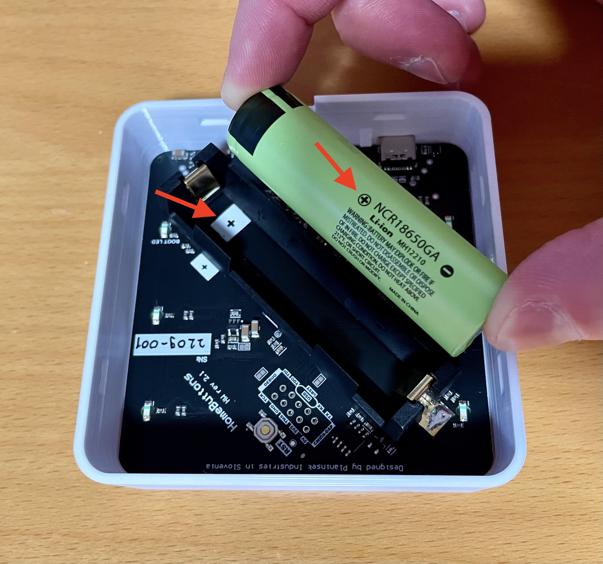
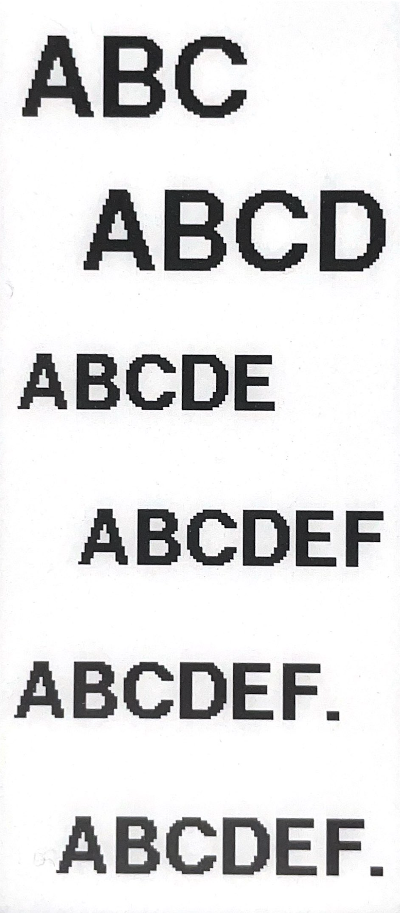
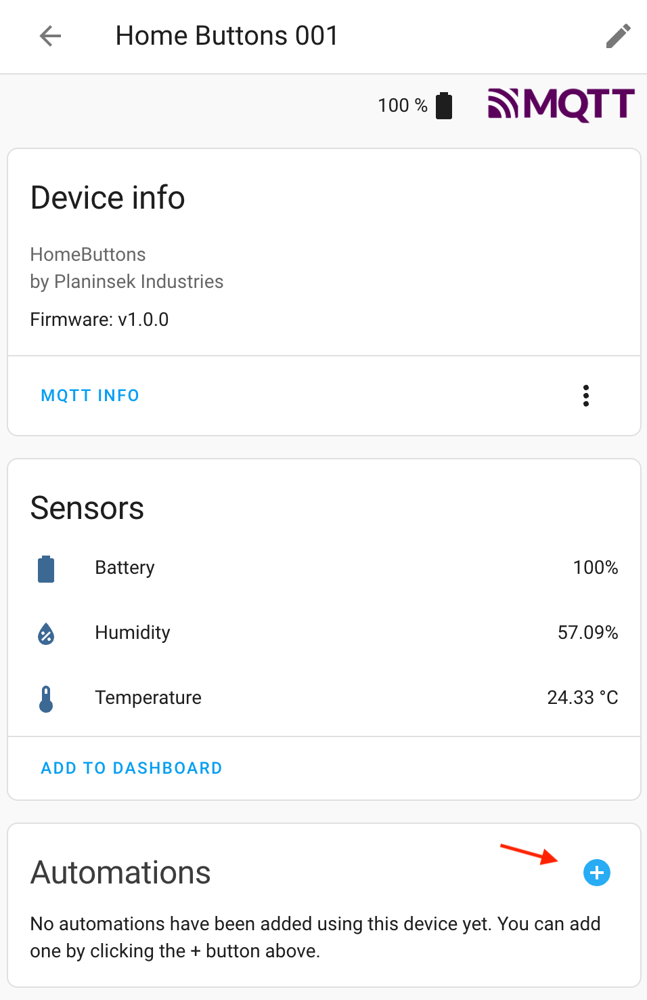

# Quick Setup

**Setup up your *Home Buttons* in a few simple steps!**

You will need:

- One 18650 battery cell (not included)
- A flat headed screwdriver
- 2x mounting screws with anchors suitable for your walls ***or*** double sided tape (must stick to plastic well)
- A Wi-Fi network
- An MQTT broker (usually installed as *Home Assistant* add-on)
- *Home Assistant* (optional - can work only through MQTT)

### Insert The Battery

You will need one 18650 Li-Ion battery cell (not included). Please only use reputable brands.

1. Open the back cover by inserting a flat headed screwdriver in the hole at the bottom and twisting it.

    {width="300"}

2. Insert the battery cell. Be careful to orient it so that polarity matches markings on the PCB.

    {width="300"}

3. Keep the back cover off for now. You will install it when mounting *Home Buttons* to the wall.

> If the device doesn't turn on by itself, please briefly connect it to a USB-C charger to wake it up.

### Set Up Wi-Fi Connection

After inserting the battery cell, *Home Buttons* will turn on automatically and start Wi-Fi setup procedure. If you don't complete the setup in 10 minutes, *Home Buttons* will turn off again to save battery. Press any button to wake up and start again.

1. *Home Buttons* establishes a Wi-Fi hotspot for configuration. Connect to it by scanning the QR code on the display or manually connecting to Wi-Fi network and entering the password.

    {width="150"}

2. After connecting to *Home Buttons* Wi-Fi with your device, a **captive portal** will pop up automatically. If it doesn't, open the web browser and navigate to any web page. You will be redirected to the captive portal.

    {width="200"}

3. Click on *"Configure WiFi"* and wait a few seconds for a list of networks to appear.

4. Select your network, enter the password and click *"Save"*.

*Home Buttons* will disable the hotspot and connect to your Wi-Fi network in a few seconds. *"Wi-Fi CONNECTED"* will appear on display.

> If connection is not successful, *"Wi-Fi error"* will be displayed and *Home Buttons* will return to welcome screen. You can start Wi-Fi setup again by pressing any button. Please make sure to enter the password correctly.

### Set Up MQTT & Buttons

When connected to your Wi-Fi network, *Home Buttons* can be configured using any device on your local network.

1. Scan the QR code or enter the displayed local IP into a web browser. The setup page will load:

    {width="250"}

2. Click *"Setup"*

3. Enter the connection parameters:

    - `Device Name` - Name of your device as it will appear in *Home Assistant*.

    - `MQTT Server` - IP address of your MQTT broker. Usually the same as IP of your *Home Assistant* server.

    - `MQTT Port` - Port used by MQTT broker. The default is usually *1883*.

    - `MQTT User` - MQTT user name (can be empty if not required by broker).

    - `MQTT Password` - MQTT password (can be empty if not required by broker).

    - `Base Topic` - MQTT topic that will be prepended to all topics used by *Home Buttons*. The default is `homebuttons`.

    - `Discovery Prefix` - *Home Assistant* parameter for MQTT Autodiscovery. The default is `homeassistant`. Leave that unchanged if you haven't modified *Home Assistant*'s configuration.

4. Enter button text

    - `BTN1 Text` - `BTN6 Text` - Text that will be displayed next to each button. The order is from top to bottom.

    *Home Buttons* will choose font size automatically. It can display around 5 letters in large font and around 10 letters in smaller font. Text over 10 letters will be clipped. Choose what you want to display wisely :)

    {width="150"}

5. Confirm by clicking *"Save"*. Device will exit the setup and display buttons.

> If MQTT connection is not successful, *"MQTT error"* will be displayed and *Home Buttons* will return to welcome screen. You can start the setup again by pressing any button. Please make sure to enter correct MQTT parameters.

### Set Up Home Assistant

*Home Buttons* uses *MQTT Discovery* and will appear in *Home Assistant*'s device list automatically. There you can see device information, sensor readings, battery state and set up button actions.

{width="300"}

To set up button actions, click "+" on *Automations* card, select one of the buttons and set up an automation with *Home Assistant*'s editor.

{width="350"}

### Mount To The Wall

TODO

### Other Important Information

TODO
