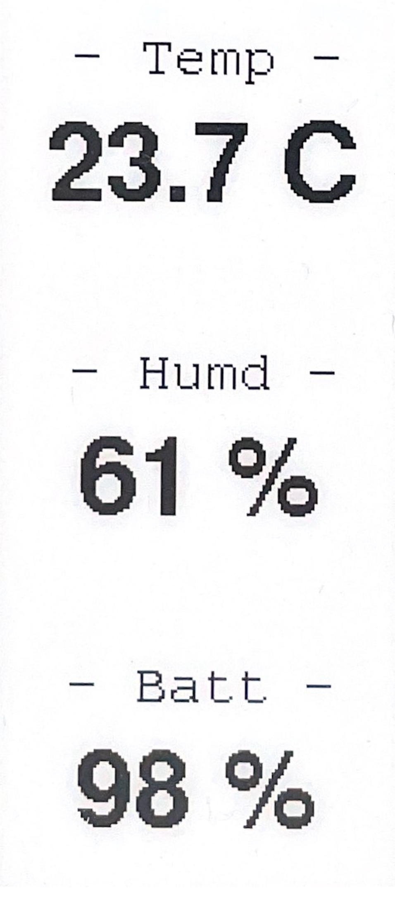
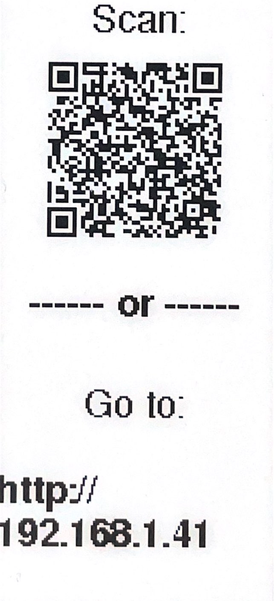
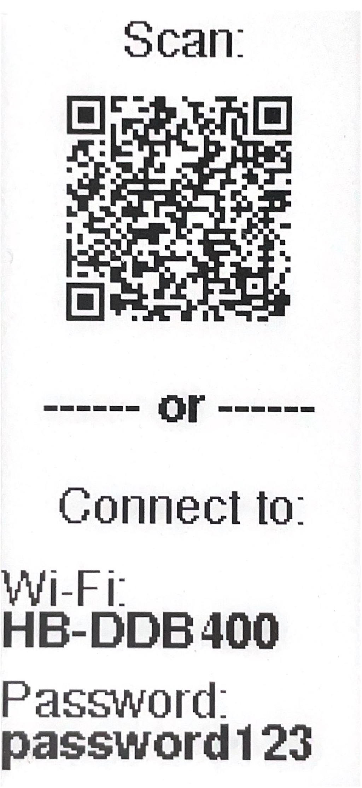

# User guide

## Controlling The Device

Press any button for:

- 2 s - [Info Screen](#info_screen)
- 10 s - [Setup](#setup)
- 20 s - [Wi-Fi Setup](#wifi_setup)
- 30 s - [Factory Reset](#factory_reset)

## Info Screen {#info_screen}

Info screen displays current temperature, humidity and battery charge percentage.

{width="125"}

Bring it up by pressing any button for 2 seconds. *Home Buttons* will automatically revert to showing button labels in 30 seconds. Or do that manually by pressing any button again.

## Setup {#setup}

Setup allows you to change connection settings and button labels. *Home Buttons* establishes a web interface accessible within the network it is already connected to.

Begin setup by pressing any button for 10 seconds. *Home Buttons* will display instructions for connecting to a web interface. Scan the QR code or enter the local IP into a web browser.

{width="125"} 
{width="250"}

### Change Wi-Fi settings

Click `Configure WiFi` to change Wi-Fi connection settings. Select a network, enter the password and click save. Wait a few seconds and then press any button to exit setup. *Home Buttons* will connect to the newly selected Wi-Fi network.

### Change MQTT settings & Button labels

Click `Setup` to change MQTT settings or button labels. A page with the following parameters will open:

- `Device Name` - Name of your device as it will appear in *Home Assistant*.

- `MQTT Server` - IP address of your MQTT broker. Usually the same as IP of your *Home Assistant* server.

- `MQTT Port` - Port used by MQTT broker. The default is usually *1883*.

- `MQTT User` - MQTT user name (can be empty if not required by broker).

- `MQTT Password` - MQTT password (can be empty if not required by broker).

- `Base Topic` - MQTT topic that will be prepended to all topics used by *Home Buttons*. The default is `homebuttons`.

- `Discovery Prefix` - *Home Assistant* parameter for MQTT discovery. The default is `homeassistant`.
Leave that unchanged if you haven't modified *Home Assistant*'s configuration.

- `Button 1 Label` - `Button 6 Label` - Label that will be displayed next to each button. The order is from top to bottom.

> *Home Buttons* will choose font size automatically. It can display around **5** letters in large font and around **7** letters in smaller font.
Labels over **7** letters will be clipped. Choose what you want to display wisely :)

> {width="125"}

When **done**, click `Save`. Device will exit the setup and display button labels.

> If MQTT connection is not successful, `MQTT error` will be displayed and *Home Buttons* will return to welcome screen.
You can start the setup again by pressing any button. Please make sure to enter correct MQTT parameters.

## Wi-Fi Setup {#wifi_setup}

If *Home Buttons* becomes inaccessible on the local network due to changed Wi-Fi settings you can restart the Wi-Fi setup at any time.

Press any button for 20 seconds.

1. *Home Buttons* will establish a Wi-Fi hotspot.
Connect to it by scanning the QR code on the display or manually connecting to Wi-Fi network and entering the password.

    {width="125"}

2. After connecting to *Home Buttons* Wi-Fi with your device, a **captive portal** will pop up automatically.
If it doesn't, open the web browser and navigate to any web page. You will be redirected to the captive portal.

    {width="200"}

3. Click `Configure WiFi` and wait a few seconds for a list of networks to appear.

4. Select your network, enter the password and click `Save`.

*Home Buttons* will disable the hotspot and connect to your Wi-Fi network in a few seconds. `Wi-Fi CONNECTED` will appear on display.

> If connection is not successful, `Wi-Fi error` will be displayed and *Home Buttons* will return to welcome screen.
You can start Wi-Fi setup again by pressing any button. Please make sure to enter the password correctly.

## Factory Reset {#factory_reset}

Factory reset deletes all user settings and returns the device to its initial state.

Perform the factory reset by pressing any button for 30 seconds. After few seconds `Factory RESET complete` will appear on screen and *Home Buttons* will restart to Wi-Fi setup. If you don't wish to complete Wi-Fi setup at this time, leave the device as is. It will automatically return to welcome screen and enter power saving state in 10 minutes.
